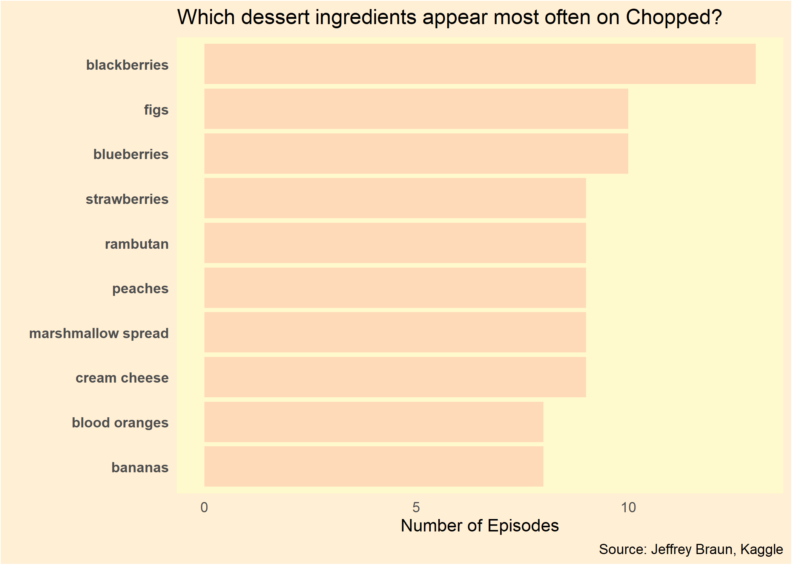

This #TidyTuesday we're going into the kitchen with data about the show Chopped. There are many great ways we could look into this data, but let's treat ourselves and look at the most commonly used dessert ingredients.
<!--more-->

## 2020-08-25 #TidyTuesday


```r
library(readr)
library(dplyr)
library(ggplot2)
library(tidyr)
library(stringr)
library(tibble)
library(purrr)
library(forcats)
```


```r
# Get Data
chopped <- readr::read_tsv('https://raw.githubusercontent.com/rfordatascience/tidytuesday/master/data/2020/2020-08-25/chopped.tsv')
```

```
## Parsed with column specification:
## cols(
##   .default = col_character(),
##   season = col_double(),
##   season_episode = col_double(),
##   series_episode = col_double(),
##   episode_rating = col_double()
## )
```

```
## See spec(...) for full column specifications.
```

```r
glimpse(chopped)
```

```
## Rows: 569
## Columns: 21
## $ season           <dbl> 1, 1, 1, 1, 1, 1, 1, 1, 1, 1, 1, 1, 1, 2, 2, 2, 2,...
## $ season_episode   <dbl> 1, 2, 3, 4, 5, 6, 7, 8, 9, 10, 11, 12, 13, 1, 2, 3...
## $ series_episode   <dbl> 1, 2, 3, 4, 5, 6, 7, 8, 9, 10, 11, 12, 13, 14, 15,...
## $ episode_rating   <dbl> 9.2, 8.8, 8.9, 8.5, 8.8, 8.5, 8.8, 9.0, 8.9, 8.8, ...
## $ episode_name     <chr> "Octopus, Duck, Animal Crackers", "Tofu, Blueberri...
## $ episode_notes    <chr> "This is the first episode with only three officia...
## $ air_date         <chr> "January 13, 2009", "January 20, 2009", "January 2...
## $ judge1           <chr> "Marc Murphy", "Aarón Sánchez", "Aarón Sánchez", "...
## $ judge2           <chr> "Alex Guarnaschelli", "Alex Guarnaschelli", "Alex ...
## $ judge3           <chr> "Aarón Sánchez", "Marc Murphy", "Marc Murphy", "Ge...
## $ appetizer        <chr> "baby octopus, bok choy, oyster sauce, smoked papr...
## $ entree           <chr> "duck breast, green onions, ginger, honey", "daiko...
## $ dessert          <chr> "prunes, animal crackers, cream cheese", "phyllo d...
## $ contestant1      <chr> "Summer Kriegshauser", "Raymond Jackson", "Margari...
## $ contestant1_info <chr> "Private Chef and Nutrition Coach  New York  NY", ...
## $ contestant2      <chr> "Perry Pollaci", "Klaus Kronsteiner", "Rachelle Ro...
## $ contestant2_info <chr> "Private Chef and Sous chef  Bar Blanc  New York  ...
## $ contestant3      <chr> "Katie Rosenhouse", "Christopher Jackson", "Chris ...
## $ contestant3_info <chr> "Pastry Chef  Olana Restaurant  New York  NY", "Ex...
## $ contestant4      <chr> "Sandy Davis", "Pippa Calland", "Andre Marrero", "...
## $ contestant4_info <chr> "Catering Chef  Showstoppers Catering at Union The...
```

## Getting counts of dessert ingredients.

Each episode has multiple dessert ingredients, so each row of data contains a list of those ingredients. We'll need to separate them out and count them up, but first we should check for and remove any NA values in the `dessert` column.

```r
# Look at dessert values. Each row has a list of ingredients.
head(chopped$dessert, 10)
```

```
##  [1] "prunes, animal crackers, cream cheese"                        
##  [2] "phyllo dough, gorgonzola cheese, pineapple rings, blueberries"
##  [3] "brioche, cantaloupe, pecans, avocados"                        
##  [4] "maple syrup, black plums, almond butter, walnuts, quick grits"
##  [5] "flour tortillas, prosecco, Canadian bacon, roasted chestnuts" 
##  [6] "beets, goat cheese, quick cook oatmeal, crystallized ginger"  
##  [7] "pitted dates, frozen pie crust, caramel candy, stout beer"    
##  [8] "plain donuts, smoked gouda, white chocolate, dried apricots"  
##  [9] "oranges, grapefruit, semi-sweet chocolate chips, bacon"       
## [10] "ginger snaps, crème fraîche, instant coffee, carrots"
```

```r
# Check for NA dessert values.
which(is.na(chopped$dessert))
```

```
## [1] 556
```

```r
# Remove row 556 which doesn't have any dessert ingredients listed.
chopped = chopped[-556, ]
```

Next we'll separate out each individual dessert ingredient from the list of lists they're currently in, and we'll use dplyr's `count` to get a count of each ingredient's appearance.

```r
# Split rows on comma and space to separate ingredients.
ingr <- stringr::str_split(chopped$dessert, ", ")
head(ingr)
```

```
## [[1]]
## [1] "prunes"          "animal crackers" "cream cheese"   
## 
## [[2]]
## [1] "phyllo dough"      "gorgonzola cheese" "pineapple rings"  
## [4] "blueberries"      
## 
## [[3]]
## [1] "brioche"    "cantaloupe" "pecans"     "avocados"  
## 
## [[4]]
## [1] "maple syrup"   "black plums"   "almond butter" "walnuts"      
## [5] "quick grits"  
## 
## [[5]]
## [1] "flour tortillas"   "prosecco"          "Canadian bacon"   
## [4] "roasted chestnuts"
## 
## [[6]]
## [1] "beets"               "goat cheese"         "quick cook oatmeal" 
## [4] "crystallized ginger"
```

```r
# Flatten list of lists to a single vector.
ingr <- purrr::flatten_chr(ingr)
head(ingr)
```

```
## [1] "prunes"            "animal crackers"   "cream cheese"     
## [4] "phyllo dough"      "gorgonzola cheese" "pineapple rings"
```

```r
# We could also use unlist and recursive = FALSE
# ingr <- unlist(ingr, recursive = FALSE)

# Convert to a tibble in order to use dplyr's count on the ingredients.
ingr <- tibble::as_tibble_col(ingr, column_name = 'ingredient')
head(ingr)
```

```
## # A tibble: 6 x 1
##   ingredient       
##   <chr>            
## 1 prunes           
## 2 animal crackers  
## 3 cream cheese     
## 4 phyllo dough     
## 5 gorgonzola cheese
## 6 pineapple rings
```

```r
# Count instances of each dessert ingredient.
ingr <- ingr %>% dplyr::count(ingredient) %>% dplyr::arrange(desc(n))
head(ingr, 10)
```

```
## # A tibble: 10 x 2
##    ingredient             n
##    <chr>              <int>
##  1 blackberries          13
##  2 blueberries           10
##  3 figs                  10
##  4 cream cheese           9
##  5 marshmallow spread     9
##  6 peaches                9
##  7 rambutan               9
##  8 strawberries           9
##  9 bananas                8
## 10 blood oranges          8
```

Now let's create our plot. We'll use `forcats::fct_reorder` to get the appropriate ingredient sort for our bars. I'm using every dessert-related color I can find from this handy [list of color names in R:](http://www.stat.columbia.edu/~tzheng/files/Rcolor.pdf) `peachpuff`, `papayawhip`, and `lemonchiffon`!

```r
# Convert list of ingredients to a factor so that we preserve our count descending ordering for our chart.
ingr$ingredient <- forcats::fct_reorder(ingr$ingredient, ingr$n, .desc = FALSE)

# Plot top 10 most frequently used ingredients.
plt_data <- head(ingr, 10)
ggplot(data = plt_data, aes(x = n, y = ingredient)) +
  geom_bar(stat = "identity", fill = "peachpuff") +
  labs(title = "Which dessert ingredients appear most often on Chopped?",
       # subtitle = "Count of episodes each dessert ingredient appeared on.",
       caption = "Source: Jeffrey Braun, Kaggle",
       y = "",
       x = "Number of Episodes") +
  theme(plot.background = element_rect(fill = "papayawhip"),
        panel.background = element_rect(fill = "lemonchiffon"),
        axis.ticks = element_blank(),
        panel.grid = element_blank(),
        axis.text.y = element_text(face = "bold"),
        plot.subtitle = element_text(face = "italic"))
```

<!-- -->


```r
# Saving a separate copy of the chart.
ggsave("chopped-desserts.png")
```

```
## Saving 7 x 5 in image
```

